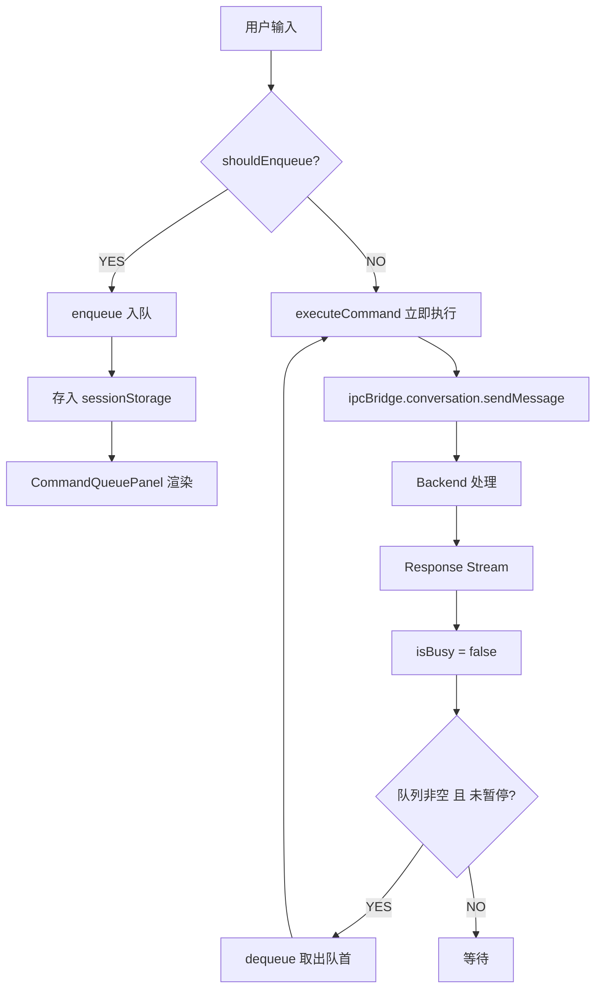
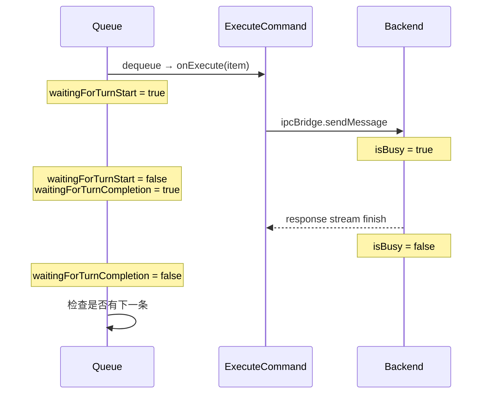
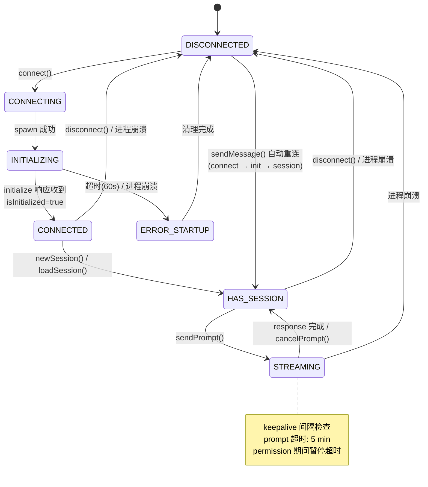
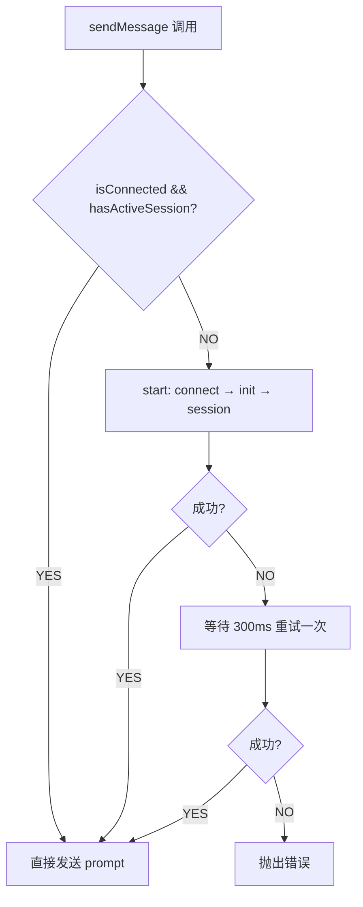
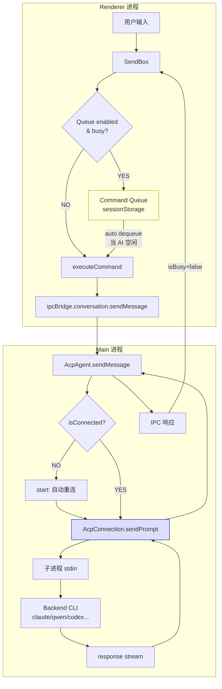

# Conversation Command Queue & ACP 状态机分析

## 1. Conversation Command Queue

### 1.1 是什么？解决什么问题？

Command Queue 是一个用户可控的命令缓冲机制。当 AI 正在处理上一条消息时，用户新发送的消息不会被丢弃，而是进入队列等待依次执行。

**没有 Queue 的问题**：用户在 AI 忙碌时发消息只会看到 "conversation in progress"，消息丢失。

**默认关闭**，需在 Settings > System > "Enable Command Queue" 手动开启。

### 1.2 核心文件

| 文件                                                                       | 职责                                             |
| -------------------------------------------------------------------------- | ------------------------------------------------ |
| `src/renderer/pages/conversation/platforms/useConversationCommandQueue.ts` | 核心 Hook，726 行，包含全部队列逻辑              |
| `src/renderer/components/chat/CommandQueuePanel.tsx`                       | 队列 UI 面板，支持编辑/拖拽/删除                 |
| `src/renderer/hooks/mcp/messageQueue.ts`                                   | MCP toast 消息队列（独立机制，非 Command Queue） |

### 1.3 数据结构与约束

```typescript
type ConversationCommandQueueItem = {
  id: string; // UUID
  input: string; // 命令文本
  files: string[]; // 附件路径
  createdAt: number; // 时间戳
};

type ConversationCommandQueueState = {
  items: ConversationCommandQueueItem[];
  isPaused: boolean; // 用户可暂停自动执行
};
```

| 约束           | 值                                 |
| -------------- | ---------------------------------- |
| 最大队列长度   | 20 条                              |
| 单条最大字符数 | 20,000                             |
| 单条最大附件数 | 50                                 |
| 队列最大存储   | 256 KB                             |
| 持久化方式     | sessionStorage（per conversation） |

### 1.4 入队条件

```typescript
shouldEnqueueConversationCommand({ enabled, isBusy, hasPendingCommands }) = enabled && (isBusy || hasPendingCommands);
```

三个条件同时满足才入队：

1. 全局开关已启用
2. AI 正忙 **或** 队列中已有待执行命令

### 1.5 在消息链路中的位置



### 1.6 完整流程

#### 入队阶段

1. 用户在 SendBox 发送消息
2. `onSendHandler` 检查 `shouldEnqueueConversationCommand()`
3. 验证约束（空输入、长度、文件数、队列满、总大小）
4. 验证失败 → `Message.warning()` 提示
5. 验证通过 → 创建 item (UUID + timestamp)，追加到队列，持久化到 sessionStorage

#### 出队阶段（自动）

1. `useEffect` 监听：`[items, isBusy, enabled, isHydrated, isInteractionLocked]`
2. 条件全部满足时：
   - 队列已开启
   - 组件已 hydrated（从 storage 恢复完成）
   - 未暂停
   - AI 空闲（`isBusy = false`）
   - 未被交互锁定（用户没在编辑/拖拽）
3. 取出队首 → 设置 `waitingForTurnStart = true` → 调用 `onExecute()`
4. 执行失败 → 将 item 恢复到队首 → 自动暂停队列

#### Turn 跟踪



### 1.7 跨平台支持

Queue 机制通过 SendBox 集成，以下平台均支持：

- Nanobot (`NanobotSendBox.tsx`)
- Gemini (`GeminiSendBox.tsx`)
- ACP (`AcpSendBox.tsx`)
- OpenClaw (`OpenClawSendBox.tsx`)
- Aionrs

---

## 2. ACP 状态管理

### 2.1 核心文件

| 文件                                        | 职责                  |
| ------------------------------------------- | --------------------- |
| `src/process/agent/acp/AcpConnection.ts`    | 核心状态机，1192 行   |
| `src/process/agent/acp/index.ts` (AcpAgent) | 上层 Agent 封装       |
| `src/process/agent/acp/acpConnectors.ts`    | 后端特定的 spawn 逻辑 |
| `src/common/types/acpTypes.ts`              | 类型定义              |

### 2.2 状态变量

ACP 没有使用单一 enum 来表示状态，而是通过**多个独立标志的组合**隐式确定：

| 变量              | 类型                   | 含义              |
| ----------------- | ---------------------- | ----------------- |
| `child`           | `ChildProcess \| null` | 子进程引用        |
| `sessionId`       | `string \| null`       | 活跃 session ID   |
| `isInitialized`   | `boolean`              | 协议握手是否完成  |
| `isSetupComplete` | `boolean`              | 启动阶段是否完成  |
| `backend`         | `AcpBackend \| null`   | 后端类型          |
| `pendingRequests` | `Map`                  | 进行中的 RPC 请求 |

派生属性：

```typescript
get isConnected(): boolean {
  return this.child !== null && !this.child.killed;
}
get hasActiveSession(): boolean {
  return this.sessionId !== null;
}
```

### 2.3 逻辑状态

| 状态              | 条件组合                                                   | 含义                   |
| ----------------- | ---------------------------------------------------------- | ---------------------- |
| **DISCONNECTED**  | child=null, sessionId=null, isInitialized=false            | 无进程，无会话         |
| **CONNECTING**    | child≠null, isInitialized=false                            | 进程启动中             |
| **INITIALIZING**  | child running, 发送 initialize 请求中                      | 协议握手中（60s 超时） |
| **CONNECTED**     | isConnected=true, isInitialized=true, isSetupComplete=true | 就绪，等待创建会话     |
| **HAS_SESSION**   | CONNECTED + sessionId≠null                                 | 可以发送消息           |
| **STREAMING**     | HAS_SESSION + pendingRequests.size>0                       | Turn 进行中            |
| **ERROR_STARTUP** | child exited, isSetupComplete=false                        | 启动阶段崩溃           |
| **ERROR_RUNTIME** | child exited, isSetupComplete=true                         | 运行时崩溃             |

### 2.4 状态转换图



### 2.5 关键方法与行号

| 方法                          | 行号      | 职责                  |
| ----------------------------- | --------- | --------------------- |
| `connect()`                   | 204-265   | 发起连接              |
| `doConnect()`                 | 267-336   | 按后端 dispatch spawn |
| `setupChildProcessHandlers()` | 338-483   | 设置协议处理器        |
| `initialize()`                | 852-867   | 发送 initialize RPC   |
| `newSession()`                | 885-929   | 创建新会话            |
| `loadSession()`               | 939-956   | 恢复已有会话          |
| `sendPrompt()`                | 1006-1024 | 发送用户消息          |
| `handleMessage()`             | 705-745   | 接收响应              |
| `handleProcessExit()`         | 489-513   | 进程退出清理          |
| `disconnect()`                | 1126-1139 | 用户主动断开          |
| `cancelPrompt()`              | 1031-1051 | 取消当前 turn         |

### 2.6 稳定性问题分析

#### 问题 1: 无并发 prompt 保护

`sendPrompt()` 没有防重入机制。如果在上一个 prompt 完成前再次调用，会在同一个进程 stdin 上发送两个请求，协议层行为未定义。

- **位置**: `AcpConnection.ts:1006`
- **风险**: 高（如果被程序式调用）
- **现状**: 依赖 UI 层不会连续调用两次

#### 问题 2: Permission 超时竞态

当 permission 请求阻塞 prompt 时，timeout 会被暂停。但如果 permission 对话框被遗忘超过 30 分钟，恢复后可能触发虚假超时。

- **位置**: `AcpConnection.ts:610-618`, `index.ts:1162-1168`

#### 问题 3: 进程状态检测时序

```typescript
private isChildAlive(): boolean {
  return this.child !== null && !this.child.killed &&
         this.child.exitCode === null && this.child.signalCode === null;
}
```

Node.js 的 `exit` 事件和 `exitCode`/`signalCode` 属性设置之间存在微小时间差，keepalive 可能读到过期状态。

- **位置**: `AcpConnection.ts:657-659`

#### 问题 4: 重复 Permission 请求覆盖

如果 agent 对同一个 `toolCallId` 发送两次 permission 请求，第二次会覆盖第一次的 pending entry，导致第一次的 resolve 回调丢失。

- **位置**: `index.ts:1140-1149`

#### 问题 5: Session ID 回退逻辑脆弱

```typescript
this.sessionId = response.sessionId || sessionId;
```

如果后端返回的 response 格式异常（sessionId 为 undefined），`||` 回退到传入的 sessionId。但如果 response 本身就是 null/undefined，会抛异常。

- **位置**: `AcpConnection.ts:949`

#### 问题 6: Setter 方法不验证连接状态

`setSessionMode()`, `setModel()`, `setConfigOption()` 只检查 `sessionId` 是否存在，不检查 `isConnected` 或进程是否存活。

- **位置**: `AcpConnection.ts:1053-1091`
- **风险**: 向已死进程发送消息

#### 问题 7: Model 双缓存不一致

`setModel()` 同时更新 `this.models` 和 `this.configOptions` 两个缓存，如果其中一个更新失败，两者状态不一致。

- **位置**: `AcpConnection.ts:1075-1086`

### 2.7 自动重连机制

当 `sendMessage()` 发现 `!isConnected || !hasActiveSession` 时，会自动调用 `start()` 执行完整的 connect → initialize → newSession/loadSession 序列。首次失败后有一次 300ms 延迟重试。



---

## 3. 两者在整体架构中的关系



Command Queue 位于 **Renderer 进程的 UI 层**，负责在用户侧缓冲命令；ACP 状态机位于 **Main 进程**，负责管理与后端 CLI 的连接和协议通信。两者通过 IPC bridge 连接，Queue 通过监听 `isBusy` 状态来决定何时出队执行下一条命令。
