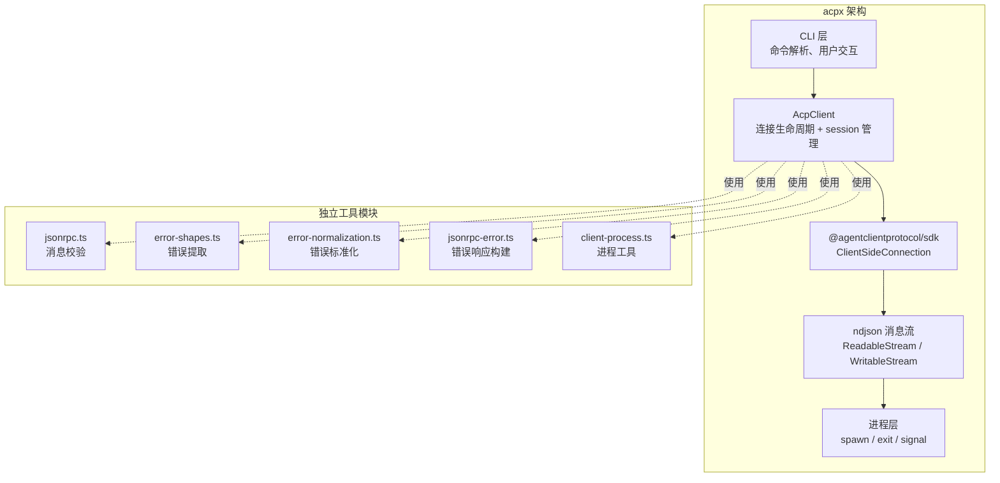
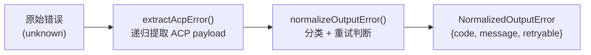
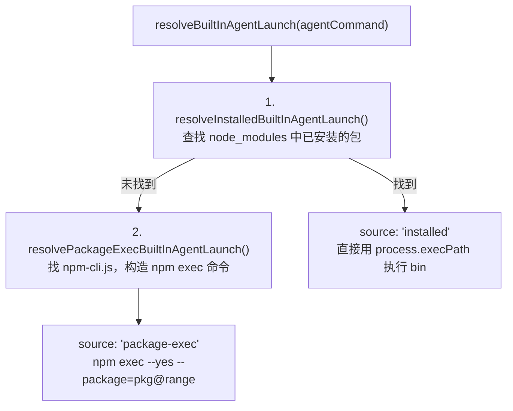

# 参考实现分析：acpx (OpenClaw) 与 Zed

> **版本**: v1.1 | **最后更新**: 2026-04-16 | **状态**: Draft
> **摘要**: 分析 OpenClaw acpx 与 Zed 编辑器的 ACP 架构设计，提取值得借鉴的模式，对比 AionUi 场景差异
> **受众**: ACP 重构实现开发者、新加入团队的开发者

---

## 目录

- [1. 背景](#1-背景)
- [2. acpx 架构概览](#2-acpx-架构概览)
- [3. Zed 架构分析](#3-zed-架构分析)
- [4. 值得借鉴的设计模式](#4-值得借鉴的设计模式)
- [5. 可直接复用的模块](#5-可直接复用的模块)
- [6. 设计理念值得参考但不直接复制的模块](#6-设计理念值得参考但不直接复制的模块)
- [7. AionUi 与 acpx 的场景差异](#7-aionui-与-acpx-的场景差异)
- [8. AcpClient 单一所有者模式：从参考实现提炼的核心改进](#8-acpclient-单一所有者模式从参考实现提炼的核心改进)
- [9. 借鉴总结](#9-借鉴总结)
- [参考文档](#参考文档)

---

## 1. 背景

[acpx](https://github.com/openclaw/acpx)（v0.5.3）是 OpenClaw 官方的 ACP 命令行客户端工具（公开仓库，可直接访问）。它的 `src/acp/` 目录实现了一个干净的 ACP 协议客户端，职责划分清晰，业务无关的协议层代码质量高。

AionUi 的 ACP 重构选择 acpx 作为参考实现，原因有三：

1. **同协议**：都是 ACP (Agent Client Protocol) 客户端，面对相同的协议规范和 agent 生态
2. **代码质量高**：模块职责清晰、纯函数比例高、错误处理完善
3. **SDK 使用示范**：展示了如何正确使用 `@agentclientprotocol/sdk`，而非手搓协议

---

## 2. acpx 架构概览

### 2.1 文件结构

```
src/acp/
├── client.ts                  # AcpClient — 连接生命周期 + session 管理
├── client-process.ts          # 进程工具函数（命令行解析、spawn 等待、退出检测）
├── jsonrpc.ts                 # JSON-RPC 2.0 消息校验与解析
├── jsonrpc-error.ts           # JSON-RPC 错误响应构建
├── error-shapes.ts            # ACP 错误提取（递归 error/cause/acp 字段）
├── error-normalization.ts     # 错误标准化（分类 + 重试判断 + 退出码映射）
├── session-control-errors.ts  # Session 控制操作错误包装
├── auth-env.ts                # 认证凭证解析（env var → config）
├── agent-command.ts           # Agent 命令识别与适配
├── agent-session-id.ts        # Session ID 提取
├── terminal-manager.ts        # 终端管理器
└── codex-compat.ts            # Codex 兼容层（Codex 特有的协议适配，AionUi 已有自己的 Codex 适配逻辑，不借鉴）
```

### 2.2 核心设计特点

acpx 的架构有四个突出特点，每一个都对应 AionUi 当前实现的一个弱点：

| acpx 做法                                                 | AionUi 当前做法                     | 差距               |
| --------------------------------------------------------- | ----------------------------------- | ------------------ |
| 使用 `@agentclientprotocol/sdk` 的 `ClientSideConnection` | 手搓 JSON-RPC ~1,100 行             | 完全缺失 SDK 使用  |
| `ReadableStream / WritableStream` 传输层抽象              | `stdout.on('data')` 直接 JSON.parse | 无传输抽象、无背压 |
| 递归提取 ACP error payload，按 code 分类                  | `errorMsg.includes()` 字符串匹配    | 结构化信息全部丢失 |
| 纯函数工具，无副作用、无外部依赖                          | 工具函数散布、风格不一致            | 难以测试和复用     |

### 2.3 架构分层



关键观察：独立工具模块与 AcpClient 是松耦合的（虚线），它们是纯函数、无状态、无外部依赖，这使得它们可以直接移植到 AionUi。

---

## 3. Zed 架构分析

### 3.1 文件结构

```
crates/
├── agent_servers/src/
│   ├── acp.rs                 # AcpConnection: spawns child, owns streams, protocol, stderr_task, wait_task
│   └── custom.rs              # CustomAgentServer: command resolution
├── acp_thread/src/
│   ├── acp_thread.rs          # AcpThread: session model, conversation state
│   └── connection.rs          # AgentConnection trait
└── util/src/
    └── process.rs             # Child process wrapper with SIGKILL process group cleanup
```

### 3.2 核心设计特点

Zed 的 ACP 实现用 Rust 所有权模型实现了确定性的进程生命周期管理，与 AionUi 当前做法形成鲜明对比：

| Zed 做法                                                              | AionUi 当前做法                                 | 差距               |
| --------------------------------------------------------------------- | ----------------------------------------------- | ------------------ |
| `AcpConnection` 单一所有者: child + io_task + wait_task + stderr_task | Connector + Protocol 分离, 无人拥有完整生命周期 | 缺失单一所有者     |
| Rust 所有权 + Drop trait 保证进程清理                                 | `shutdown()` 手动调用, 容易遗漏                 | 缺乏确定性清理     |
| 三个独立后台任务 (io/wait/stderr)                                     | 只监听 `protocol.closed` Promise                | 缺少多信号检测     |
| `LoadError::Exited { status }` 通知所有 session                       | 进程退出时仅 SDK 报 "ACP connection closed"     | 缺少结构化退出信息 |

### 3.3 进程生命周期管理

Zed 的 `AcpConnection` 通过三个后台任务实现全方位的进程监控：

- **`_wait_task`**：调用 `child.status().await`，进程退出时发出 `LoadError::Exited { status }` 通知到所有 session，确保上层立即感知进程终止
- **`_stderr_task`**：逐行读取 stderr 内容，以 warn 级别记录日志，为排查 agent 异常提供诊断信息
- **`_io_task`**：运行协议 I/O 循环，当 stdin/stdout 关闭时自动失败退出

关键设计：`AcpConnection` 实现了 `Drop` trait，在结构体被销毁时自动 kill 子进程——这是 Rust 所有权模型带来的确定性清理保证。无论代码路径如何（正常返回、panic、early return），进程都会被正确清理。

Zed **不做自动重试**——进程崩溃导致连接进入错误状态，由用户触发 `reset()` 重新建立连接。这个设计选择符合"让用户控制"的原则，避免了自动重试带来的状态不一致问题。

### 3.4 架构分层

```
UI Layer (ConversationView)
  → Connection Store (AgentConnectionStore): caches connections, removes failed entries
    → Server Layer (CustomAgentServer): resolves commands, calls acp::connect()
      → Connection Layer (AcpConnection): owns child + tasks + protocol
        → Thread Layer (AcpThread): session state, entries, plan
```

Zed 的分层清晰地将"连接管理"与"会话状态"分离：`AcpConnection` 负责进程生命周期和协议通信，`AcpThread` 负责会话内容和对话状态。`AgentConnectionStore` 作为缓存层，按 agent 命令缓存连接实例，失败时自动移除条目。

---

## 4. 值得借鉴的设计模式

### 4.1 SDK 驱动而非手搓协议

acpx 使用 `@agentclientprotocol/sdk` 提供的 `ClientSideConnection` 处理 JSON-RPC 请求/响应/通知的路由。SDK 提供了：

- 完整的 ACP 方法封装（`initialize`、`newSession`、`loadSession`、`prompt`、`cancel`、`setSessionMode`、`unstable_setSessionModel`、`setSessionConfigOption` 等）
- 全套 TypeScript 类型定义
- 标准的 JSON-RPC 2.0 消息路由

**启示**：AionUi 应引入同一个 SDK，消除 `AcpConnection` 中 1,100+ 行的手搓代码。SDK 处理的是协议层的机械性工作（消息序列化/反序列化、请求/响应匹配、notification 路由），这些工作没有业务价值，且手搓容易出错。

### 4.2 传输层抽象

acpx 的 `createNdJsonMessageStream()` 将子进程 stdio 转为类型化的消息流：

```
子进程 stdout (bytes) → ReadableStream<AnyMessage>
子进程 stdin  (bytes) ← WritableStream<AnyMessage>
```

这层抽象带来三个好处：

1. **背压控制**：Web Streams API 内建背压机制，上游发送过快时自动降速
2. **传输可替换**：切换到 WebSocket 只需替换 stream 构造，协议逻辑不变
3. **可测试性**：可以用内存 stream 替代真实 stdio 进行测试

### 4.3 结构化错误处理链

acpx 的错误处理是一条清晰的链路：



- **extractAcpError()**：从 `error` / `cause` / `acp` 字段中递归提取（最多 5 层）`{code: number, message: string, data?: unknown}` 格式的 ACP 错误
- **normalizeOutputError()**：将提取的错误映射为标准化结构，包含 error code（`RUNTIME | TIMEOUT | NO_SESSION | PERMISSION_DENIED | ...`）、是否可重试 (`retryable`)、来源 (`origin`) 等字段
- **isRetryablePromptError()**：基于 ACP error code 判断重试可行性（`-32603/-32700` 可重试；auth/session-not-found/permission 不可重试）

**对比 AionUi**：当前实现收到 error response 时只做 `message.error?.message || 'Unknown ACP error'`，丢失了 code 和 data，然后用字符串 `includes()` 匹配来分类。信息在第一步就丢了，后续无论怎么改善分类逻辑都无济于事。

### 4.4 三级优雅关闭

acpx 的 `AcpClient.close()` 实现了三级关闭策略：

1. **stdin.end()** -- 最优雅。关闭写入端，让 agent 自行检测到输入结束并清理退出
2. **SIGTERM** -- 超时后发送终止信号
3. **SIGKILL** -- 再超时后强制杀死

AionUi 的 `killChild` 直接从 SIGTERM 开始，缺少 stdin 关闭这个最优雅的阶段。stdin.end() 给了 agent 进程自行清理（保存状态、关闭连接等）的机会，这对会话恢复的可靠性很重要。

### 4.5 Tapped Stream 调试机制

acpx 的 `createTappedStream()` 在不修改原始 stream 的情况下插入 inbound/outbound 消息观察点，用于：

- 调试时打印所有 JSON-RPC 消息
- 记录消息时间戳用于性能分析
- 触发事件通知（如"收到第一条消息"）

AionUi 当前没有等价机制。当需要调试特定 agent 的协议交互时，只能手动在代码中加 console.log。

---

## 5. 可直接复用的模块

以下模块与 acpx 业务逻辑无关，是纯函数或纯数据转换，可直接移植到 AionUi 的新架构中。

### 5.1 client-process.ts -- 进程工具

约 155 行，零外部依赖（仅 `node:child_process` 和 `node:path`）。

| 函数                                 | 用途                                                               |
| ------------------------------------ | ------------------------------------------------------------------ |
| `splitCommandLine(value)`            | 命令行解析，支持单/双引号和反斜杠转义                              |
| `waitForSpawn(child)`                | Promise 化的 spawn 等待（spawn/error 事件对）                      |
| `waitForChildExit(child, timeoutMs)` | 带超时的进程退出等待（事件驱动，非轮询）                           |
| `isChildProcessRunning(child)`       | `exitCode == null && signalCode == null`（比 `child.killed` 准确） |
| `basenameToken(value)`               | 提取命令基名并去掉 `.exe/.cmd/.bat` 后缀                           |
| `isoNow()`                           | ISO 时间戳                                                         |
| `asAbsoluteCwd(cwd)`                 | `path.resolve` 封装                                                |

**替代 AionUi 的**：`utils.ts` 中的 `waitForProcessExit()`（50ms 轮询）、`isProcessAlive()`（signal 探测）、`acpConnectors.ts` 中的 `cliPath.split(' ')`（不支持引号）。

### 5.2 jsonrpc.ts -- JSON-RPC 消息校验

约 138 行。严格按 JSON-RPC 2.0 规范校验消息结构。

| 函数                                        | 用途                                                                   |
| ------------------------------------------- | ---------------------------------------------------------------------- |
| `isAcpJsonRpcMessage(value)`                | 完整的 JSON-RPC 2.0 消息校验（notification / request / response 三路） |
| `isJsonRpcNotification(message)`            | 区分 notification（有 method 无 id）和 request                         |
| `isSessionUpdateNotification(message)`      | 判断 `method === 'session/update'`                                     |
| `extractSessionUpdateNotification(message)` | 安全提取 `{sessionId, update}`                                         |
| `parsePromptStopReason(message)`            | 从 response.result 提取 `stopReason`                                   |
| `parseJsonRpcErrorMessage(message)`         | 从 response.error 提取 `message`                                       |

校验内容包括：`jsonrpc: "2.0"` 版本号、`id` 类型（`string | number | null`）、`error` 结构体（`{code: number, message: string}`）等。AionUi 当前完全缺失这类校验。

### 5.3 error-shapes.ts -- ACP 错误提取

约 154 行。核心函数 `extractAcpError()` 递归（最多 5 层）从 `error` / `cause` / `acp` 字段中提取 `{code: number, message: string, data?: unknown}` 格式的 ACP 错误。

这是**最有价值的单个函数**。AionUi 当前收到 error response 时只做 `message.error?.message || 'Unknown ACP error'`，丢失了 code 和 data，导致后续无法按 code 分类错误。`extractAcpError()` 解决了这个信息丢失问题。

其他函数：

| 函数                                | 用途                                                                                                   |
| ----------------------------------- | ------------------------------------------------------------------------------------------------------ |
| `formatUnknownErrorMessage(error)`  | 通用 unknown -> string 转换，四级降级（Error 实例 -> 带 message 的对象 -> JSON.stringify -> String()） |
| `isAcpResourceNotFoundError(error)` | 检测 session 丢失（code -32001/-32002 + 文本匹配兜底）                                                 |

### 5.4 error-normalization.ts -- 错误标准化

约 288 行。将各种错误统一为结构化的 `NormalizedOutputError`：

```typescript
type NormalizedOutputError = {
  code: OutputErrorCode; // RUNTIME | TIMEOUT | NO_SESSION | PERMISSION_DENIED | ...
  message: string;
  detailCode?: string; // AUTH_REQUIRED 等细分码
  origin?: OutputErrorOrigin;
  retryable?: boolean;
  acp?: { code: number; message: string; data?: unknown };
};
```

关键能力：

- **按 code 分类**：而非按消息文本分类
- **重试判断**：ACP `-32603`（Internal error）/ `-32700`（Parse error）可重试；auth / session-not-found / permission 不可重试
- **退出码映射**：error code 到进程退出码的映射（CLI 场景使用）

移植到 AionUi 时，acpx 的 `OutputErrorCode` 需要映射到新架构的 `AcpErrorCode`。主要映射关系：`RUNTIME` -> `AGENT_ERROR`、`TIMEOUT` -> `PROMPT_TIMEOUT`、`NO_SESSION` -> `SESSION_EXPIRED`、`PERMISSION_DENIED` -> `PERMISSION_DENIED`（保持一致）。完整的 `AcpErrorCode` 枚举定义见 [04-type-catalog.md](04-type-catalog.md)。

### 5.5 jsonrpc-error.ts -- JSON-RPC 错误响应构建

约 88 行。根据错误类型构建规范的 JSON-RPC 2.0 error response，包含错误码映射表：

```typescript
NO_SESSION: -32002;
TIMEOUT: -32070;
PERMISSION_DENIED: -32071;
PERMISSION_PROMPT_UNAVAILABLE: -32072;
RUNTIME: -32603;
USAGE: -32602;
```

**替代 AionUi 的**：硬编码 `{ code: -32603, message: ... }`，所有错误都报为 Internal error。

### 5.6 session-control-errors.ts -- Session 控制错误

约 64 行。包装 `session/set_mode`、`session/set_model`、`session/set_config_option` 的错误，能区分"agent 不支持该方法"（code `-32601`/`-32602`）和其他错误类型。

**替代 AionUi 的**：`setSessionMode` / `setModel` / `setConfigOption` 都是简单 try-catch + `console.warn`，无法区分不同的错误原因。

---

## 6. 设计理念值得参考但不直接复制的模块

以下模块的代码与 acpx 业务逻辑耦合，不能直接复制，但其设计模式值得在 AionUi 新架构中借鉴。

### 6.1 AcpClient 连接管理模式

acpx `AcpClient` 的连接管理有几个亮点：

- **pendingConnectionRequests**：跟踪所有 in-flight 的 JSON-RPC 请求。Agent 断开时批量 reject 所有 pending 请求，确保调用方不会永远等待。实现方式是 `runConnectionRequest()` 包装每个请求，统一注册和清理。
- **三级关闭**：如上文 4.4 节所述。
- **Tapped stream**：如上文 4.5 节所述。

AionUi 的 `handleProcessExit` 做了类似 pending request reject 的事情，但 acpx 的实现更干净（单一入口 `runConnectionRequest`，自动注册/清理）。

### 6.2 Agent 生命周期观察

`attachAgentLifecycleObservers()` 统一监听 `exit` / `close` / `stdout.close` 三个事件，且只记录第一次退出信息（`recordAgentExit` 幂等），维护 `AgentExitInfo` 快照。

AionUi 只监听了 `exit` 事件。在某些边缘情况下（如 agent 进程被外部 kill），`exit` 事件可能不触发，但 `close` 事件会。监听多个事件并取第一次是更稳健的做法。

### 6.3 Agent Registry 与两级解析策略

acpx 的 agent 启动不是直接跑 `npx`，而是用两级解析策略：



**优先本地已安装**（installed）：从当前文件位置向上遍历目录树，找 `node_modules/<package>/package.json`，读取 bin 字段，用 `process.execPath` 直接执行 bin 文件。优点是零网络、零延迟、版本确定。

**兜底 npm exec**（package-exec）：找到 Node 安装目录下的 `npm-cli.js`，构造 `npm exec --yes --package=<pkg>@<range> -- <bin>` 命令。直接调用 `npm-cli.js` 而非 `npx` shim，绕过了 Windows 上 `.cmd` shim 的路径解析问题。

其他设计亮点：

- **alias 支持**：`factory-droid` / `factorydroid` -> `droid`
- **registry 可覆盖**：`mergeAgentRegistry(overrides)` 允许用户配置覆盖内置命令
- **DI 友好**：resolver 函数接受 `options`（`existsSync`、`readFileSync`、`resolvePackageRoot`），方便单元测试
- **AGENT_REGISTRY 集中管理**：约 15 个 agent 的命令映射在一处定义，版本范围集中管理

---

## 7. AionUi 与 acpx 的场景差异

acpx 是 CLI 工具，AionUi 是 Electron 桌面应用。两者虽然使用同一协议，但运行环境和产品需求有显著差异，不能盲目照搬。

### 7.1 关键差异对比

| 维度             | acpx (CLI)                   | AionUi (Electron 桌面应用)                           |
| ---------------- | ---------------------------- | ---------------------------------------------------- |
| **生命周期**     | 单次运行，用完即退           | 长期驻留，用户可能开着好几天                         |
| **并发 session** | 单 session                   | 多 session 并行（多个对话窗口）                      |
| **内存管理**     | 进程退出即释放               | 需要主动管理（空闲回收、LRU 缓存上限）               |
| **用户环境**     | 开发者终端，环境可控         | 用户桌面，环境千差万别                               |
| **NPX 问题**     | 较少（开发者环境）           | 频繁（npx cache 腐败、PATH 问题、Windows .cmd shim） |
| **权限 UI**      | 终端交互                     | 富 GUI 卡片（选项、始终允许、超时）                  |
| **会话恢复**     | 简单（CLI flag）             | 复杂（数据库持久化、跨重启恢复）                     |
| **IPC 层**       | 不需要                       | 需要（Electron 主进程 <-> 渲染进程）                 |
| **多后端**       | 通过命令行参数指定           | 25+ 后端动态发现、注册、切换                         |
| **状态管理**     | 无显式状态机（CLI 单次运行） | 7 态状态机（D1 决议）                                |

### 7.2 AionUi 必须额外解决的问题

以下是 acpx 不需要考虑、但 AionUi 必须处理的问题：

1. **多 session 管理**：AcpRuntime 维护 `Map<convId, AcpSession>`，处理 session 间的资源隔离和空闲回收
2. **数据库持久化**：session 状态持久化到 SQLite（`acp_session` 表），支持跨应用重启恢复
3. **IPC 路由**：渲染进程的方法调用通过 IPC 路由到对应的 session 实例
4. **内存有界**：所有有状态结构需要明确上限（ApprovalCache LRU 500 条、NdjsonTransport highWaterMark 64）
5. **Agent 发现**：三级发现机制（内置、扩展、自定义），Hub 安装/更新/卸载
6. **NPX 降级与重试**：内置 bun/bunx 替代系统 npm/npx，减少环境依赖

### 7.3 acpx 启动策略的借鉴与调整

| 维度          | acpx                              | AionUi 当前                              | AionUi 新架构（调整后）               |
| ------------- | --------------------------------- | ---------------------------------------- | ------------------------------------- |
| npx 启动      | 优先本地已安装 -> 兜底 `npm exec` | `npx --prefer-offline` -> 重试           | 内置 bun/bunx，Hub 安装到固定目录     |
| npx shim 问题 | 直接调用 `npm-cli.js` 绕过        | Windows `chcp` workaround                | 内置 bun 绕过                         |
| 缓存问题      | 不存在（installed 路径不走缓存）  | 检测 stale cache -> 清理重试             | 内置运行时 + 固定安装目录，不依赖缓存 |
| 版本管理      | `packageRange` 集中定义           | 版本号散布在常量中                       | Agent 发现层统一管理                  |
| 平台处理      | DI 注入 `existsSync` 等           | 大量 `process.platform === 'win32'` 分支 | Connector 内部封装平台差异            |

AionUi 的复杂度部分来自桌面应用的现实（用户环境千差万别、npx cache 经常腐败）。新架构通过内置 bun/bunx 和 Hub 固定安装目录两个设计决策，从根源上减少了对 npx 的依赖，使启动策略大幅简化。

---

## 8. AcpClient 单一所有者模式：从参考实现提炼的核心改进

### 8.1 问题：当前 V2 设计的职责割裂

当前 V2 设计将进程生命周期拆分到多个模块中：

- `ConnectorFactory → AgentConnector → ConnectorHandle { stream, shutdown }`（拥有进程）
- `AcpProtocol(stream)`（包装 SDK，不知道进程的存在）
- `AcpSession`（编排两者，但无法直接获取进程信息）

当 SDK 抛出 "ACP connection closed" 时，这条链路中**没有任何一个节点拥有完整上下文**（stderr 内容、退出码、退出原因）。ConnectorHandle 知道进程退了，但不知道 SDK 在做什么；AcpProtocol 知道连接断了，但不知道为什么；AcpSession 两边都问不到完整信息。

### 8.2 参考实现的共同模式：单一所有者

acpx 和 Zed 用完全不同的语言和架构，却不约而同地采用了同一个模式——**单一所有者拥有连接的全部资源**：

- **acpx**: `AcpClient`（1400+ 行 TypeScript）—— 拥有子进程、streams、SDK connection、stderr buffer、lifecycle observers、pending request tracking
- **Zed**: `AcpConnection`（Rust struct）—— 拥有 Child、`_io_task`、`_wait_task`、`_stderr_task`、protocol connection

两者的共同点：

1. 进程生命周期和协议状态在**同一个对象**中管理
2. 进程退出时，所有者能立即获取完整上下文（exit code + signal + stderr）
3. 连接断开的通知携带结构化信息，而非 SDK 的不透明错误字符串
4. 所有者销毁时保证进程清理（acpx 通过 `close()` 三级关闭，Zed 通过 `Drop` trait）

### 8.3 提炼：AcpClient 接口

综合两个参考实现的模式，提出 `AcpClient` 接口——合并 `ConnectorHandle + AcpProtocol` 为单一抽象：

**核心方法**：

- `start()`：一个方法完成 spawn + stream 建立 + SDK 初始化 + 启动失败看门狗（`Promise.race` 检测启动阶段崩溃）
- 协议方法：`createSession`、`prompt`、`cancel`、`setSessionMode`、`setModel` 等——直接代理 SDK，无需经过 AcpProtocol 中间层
- `lifecycleSnapshot`：随时可用的生命周期快照，包含 exit code + signal + stderr 尾部内容
- `onDisconnect(handler)`：断连回调，携带完整上下文（不是 SDK 的不透明 "ACP connection closed"）
- `close()`：三级优雅关闭（stdin.end → SIGTERM → SIGKILL）

**两个实现**：

- **`ProcessAcpClient`**：本地子进程实现。继承 acpx 的所有模式——pending request tracking、lifecycle observers（exit + close + stdout.close 三事件）、stderr 环形缓冲、启动失败看门狗
- **`WebSocketAcpClient`**：远程 WebSocket 实现。无进程管理，仅处理 WebSocket 连接状态和协议方法代理

这个设计消除了 8.1 节描述的职责割裂问题：当连接出问题时，`AcpClient` 自身就拥有所有诊断信息，无需跨模块拼凑。

---

## 9. 借鉴总结

### 9.1 直接复用

以下模块已纳入新架构的 Infrastructure Layer 和 Cross-cutting 层：

| acpx 模块                   | 新架构对应                       | 调整说明                                                                                        |
| --------------------------- | -------------------------------- | ----------------------------------------------------------------------------------------------- |
| `client-process.ts`         | `processUtils.ts`                | 直接移植，补充 gracefulShutdown（三级关闭）                                                     |
| `jsonrpc.ts`                | SDK 内部处理 + `NdjsonTransport` | 引入 SDK 后大部分校验由 SDK 完成                                                                |
| `error-shapes.ts`           | `errors/errorExtract.ts`         | 直接移植                                                                                        |
| `error-normalization.ts`    | `errors/errorNormalize.ts`       | 移植核心逻辑，调整 error code 枚举适配 AionUi                                                   |
| `jsonrpc-error.ts`          | `errors/errorJsonRpc.ts`         | 直接移植                                                                                        |
| `session-control-errors.ts` | `errors/errorSessionControl.ts`  | 直接移植（Doc 3 文件清单未单独列出，其逻辑已内联到 `AcpProtocol.ts` 和 `errorNormalize.ts` 中） |
| AcpClient 连接管理          | `infra/AcpClient.ts`             | 合并 Connector + Protocol, 单一所有者                                                           |

### 9.2 借鉴设计模式

| acpx / Zed 模式             | 新架构采纳方式                                                                                                     |
| --------------------------- | ------------------------------------------------------------------------------------------------------------------ |
| SDK 驱动                    | `AcpClient` 内部包装 `ClientSideConnection`，不手搓 JSON-RPC                                                       |
| 传输层抽象                  | `NdjsonTransport`（byte stream <-> typed message stream）                                                          |
| 三级关闭                    | `processUtils.gracefulShutdown()`：stdin.end() -> SIGTERM -> SIGKILL                                               |
| pending request 批量 reject | `AcpClient` 内部 `runConnectionRequest()` 包装每个请求，断连时批量 reject                                          |
| 多事件生命周期监听          | `ProcessAcpClient` 内部 `attachLifecycleObservers()`：exit + close + stdout.close，幂等记录退出信息                |
| Tapped stream               | 架构预留消息观察注入点（Phase 1 依赖 console.log 调试协议交互，Phase 2 考虑引入类似 tapped stream 的消息观察机制） |
| 启动失败看门狗              | `ProcessAcpClient.start()` 内部 `Promise.race`：SDK 初始化与进程退出竞争，启动阶段崩溃立即报错                     |
| stderr ring buffer          | `ProcessAcpClient` 内部 8KB 环形缓冲，断连时 `lifecycleSnapshot` 携带 stderr 尾部内容                              |

### 9.3 因场景差异不采纳的部分

| acpx / Zed 做法     | 不采纳原因                                                                                                                                                                           |
| ------------------- | ------------------------------------------------------------------------------------------------------------------------------------------------------------------------------------ |
| 两级 agent 解析策略 | AionUi 内置 bun + Hub 固定目录，不需要 node_modules 遍历                                                                                                                             |
| 单 client 模型      | acpx/Zed 的单 client 服务单 session 模型不直接适用——AionUi 需要多 session 并行。但我们采纳了单一所有者模式：每个 session 对应一个 `AcpClient` 实例，由 `AcpRuntime` 统一管理生命周期 |
| CLI 交互式权限      | AionUi 使用 GUI 权限卡片，权限流程更复杂（始终允许、超时、多选项）                                                                                                                   |

---

## 参考文档

- [01-current-problems.md](01-current-problems.md) -- 当前 ACP 实现问题分析
- [03-architecture-design.md](03-architecture-design.md) -- 新架构总览（待撰写）
- 源材料：`02-acpx-reference.md`（原始 acpx 分析）
- 外部参考：[acpx 源码](https://github.com/openclaw/acpx) v0.5.3
